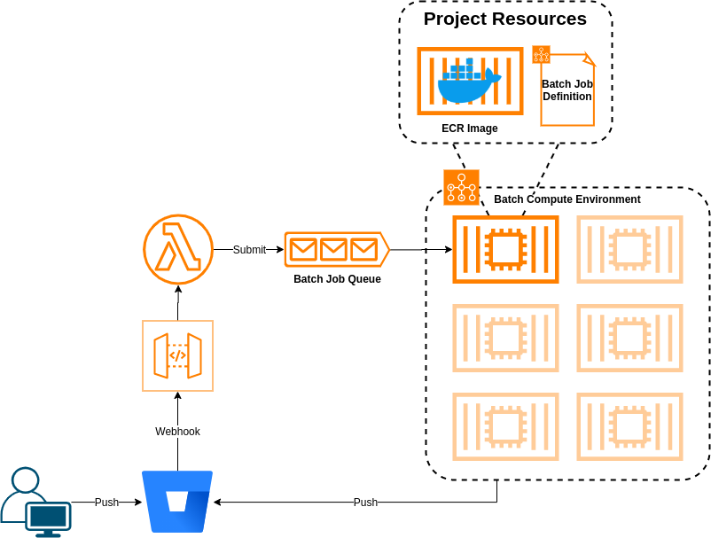

# DVC Cloud Experiment Runner



## Adding a new project

1. Write a CloudFormation template with an ECR repo, Batch job definition, and any other AWS resources needed for the new project. See `cloudformation.example-project.yml` for an example.
    1. The ECR repo should be called `acme/$REPO_NAME`, where $REPO_NAME is the name of the Bitbucket repo.
    2. Similarly, the job definition should be called `acme-${Environment}-ml-${REPO_NAME}`. Make sure the specify sane defaults for the compute resources.
2. Deploy the CloudFormation stack
3. Give the acme-machine Bitbucket user write permission on the new repo.
4. Create a new webhook for the repo:
   - URL: the `/bitbucket-webhook` path of the API deployed as part of this repo's production CloudFormation stack
   - **Enable request history collection**. It'll be useful for the next step
   - Triggers: "Repository push" should be fine for most use cases
5. Bitbucket should now fire off a "hello world" request to the API (click View Requests). It'll be denied because the webhook is not authorized. Open the request details and get the value of the "X-Hook-UUID" header of the request.
6. Go to AWS SecretsManager and add the webhook UUID to the list of authorized UUIDs in the "acme/production/bitbucket-webhook-uuids" secret.
7. Wait a few minutes for AWS to dispose of the old Lambda container (otherwise it'll have the old list of authorized webhooks).
8. Hit retry or push a new commit and watch the build happen

## Triggering a build

To trigger a build in the cloud, make and push a commit with one or more of the below keywords in the message. Each keyword must be surrounded by colons (:) and be **at the start of its own line**. For more information on specifying resource requirements, see the [AWS Batch documentation](https://docs.aws.amazon.com/batch/latest/APIReference/API_ResourceRequirement.html).

| Keyword      | Arguments | Description                                                     |
| ------------ | :-------: | --------------------------------------------------------------- |
| ACME_RUN     | OPTIONAL  | Triggers the job, and passes arguments to `dvc repro`           |
| ACME_RUN_EXP |    NO     | Run `dvc exp run` instead of `dvc repro`                        |
| ACME_GPUS    | OPTIONAL  | The number of GPUs for the job, or 1 of no argument is provided |
| ACME_MEMORY  |    YES    | The amount of RAM (in MiB) for the job. Requires an argument    |
| ACME_VCPUS   |    YES    | The number of vCPUs for the job. Requires an argument           |


### Examples

Trigger a job for a single pipeline stage with no GPUs but a lot of memory
```
Added new features to data

:ACME_RUN: --single-item featurize_data
:ACME_GPUS: 0
:ACME_MEMORY: 32768
```

Trigger an experiment with 1 GPU (the default if no argument is passed)
```
Hyperparameter scanning experiment

:ACME_RUN: --params learning_rate=0.01
:ACME_RUN_EXP:
:ACME_GPUS:
```
